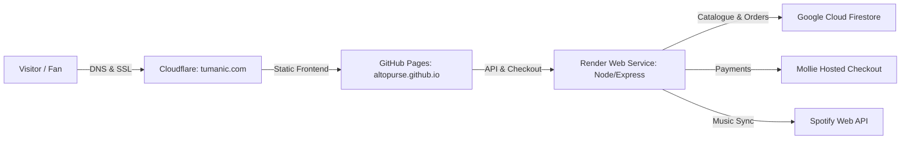

# TUMANIC M·A·E — Complete Handover Guide for Jamie

This guide outlines how to transfer ownership, manage accounts, and operate the live website (**[tumanic.com](https://tumanic.com)**).

---

## 1. Architecture Overview

---

## 2. GitHub Transfer (Front-End & Content)

The repository holds all website code, styles, artwork images, and catalogue JSON.

### How to Transfer:
1. Go to repository **Settings** → scroll to the bottom **Danger Zone**.
2. Click **Transfer ownership**.
3. Enter Jamie's GitHub username.
4. Once Jamie accepts, the repo will move to `https://github.com/<jamie-username>/altopurse.github.io` (or repo renamed to `<jamie-username>.github.io` / `tumanic-web`).

### If Keeping Current Repo and Adding Jamie as Admin:
- Go to repository **Settings** → **Collaborators** → **Add people** → Enter Jamie's username/email → Grant **Admin** access.

### GitHub Pages Settings:
- **Settings** → **Pages**:
  - Source: Deploy from branch `main` / `root`.
  - Custom domain: `tumanic.com`.
  - Enforce HTTPS: **Checked**.

---

## 3. Cloudflare Transfer (Domain, DNS & SSL)

Cloudflare manages the `tumanic.com` domain, DNS routing, and edge SSL certificates.

### How to Transfer / Invite Jamie:
1. Log into the Cloudflare Dashboard.
2. In the top navigation, go to **Manage Account** → **Members**.
3. Click **Invite Member**, enter Jamie's email address, select role **Administrator** (or **Super Administrator**), and send the invite.

### DNS Records Reference:
| Type | Name | Content / Target | Proxy Status |
|---|---|---|---|
| `CNAME` | `@` (or Apex) | `altopurse.github.io` (or `<jamie>.github.io`) | Proxied (Orange cloud) |
| `CNAME` | `www` | `altopurse.github.io` (or `<jamie>.github.io`) | Proxied (Orange cloud) |

- **SSL/TLS Mode**: Ensure encryption is set to **Full** or **Full (strict)**.

---

## 4. Render Transfer (Back-End API)

The backend web service (`node index.js`) runs in Frankfurt on Render and handles checkout, catalogue syncing, Spotify fetching, and analytics.

### How to Transfer / Add Jamie:
1. Log into the Render Dashboard.
2. Go to **Account Settings** / **Workspace** → **Members**.
3. Invite Jamie's email with **Admin** access.

### Environment Variables Checklist (Render Dashboard):
| Variable | Purpose |
|---|---|
| `ADMIN_TOKEN` | Secret passcode to unlock the `/admin/` portal |
| `SITE_ORIGIN` | `https://tumanic.com,https://www.tumanic.com,https://altopurse.github.io` |
| `GOOGLE_APPLICATION_CREDENTIALS_JSON` | Firebase / Firestore Service Account JSON credentials |
| `FIRESTORE_PROJECT_ID` | Google Cloud project ID |
| `MOLLIE_API_KEY` | Live API key from Mollie dashboard for payments |
| `SPOTIFY_CLIENT_ID` | Spotify Developer app Client ID |
| `SPOTIFY_CLIENT_SECRET` | Spotify Developer app Client Secret |
| `SPOTIFY_ARTIST_ID` | `5AhJwuhl8vQJB0rBqZ7UFI` |
| `BUTTONDOWN_API_KEY` | (Optional) Newsletter API key |

---

## 5. Day-to-Day Operations for Jamie

Jamie can manage the site right from his phone without editing code:

### Admin Dashboard ([tumanic.com/admin/](https://tumanic.com/admin/))
- **Login**: Enter the `ADMIN_TOKEN`.
- **View Stats**: Real-time traffic, top rooms listened to (Glass, Rage, Padded, Forest), device types, and visitor referrers.
- **Stock the shop**: Click **Stock the shop** whenever `data/artworks.json` or pricing is updated.
- **Sync Spotify Releases**: Click **Sync releases from Spotify** to automatically pull his latest tracks into the player.
- **Reports**: Jamie can submit feedback, bug reports, and upload photos directly from the Reports form.

---

## 6. How Artwork & Music Are Updated

1. **Adding/Editing Artworks**:
   - Update `data/artworks.json`.
   - Place WebP image derivatives in `assets/art/`.
   - Push to `main`. Render auto-seeds Firestore on boot, and the frontend updates immediately.
2. **Pricing Rules**:
   - `inquireOnly: true`: Hides raw price on store and renders an **Enquire** button opening `mailto:tumanicmae@gmail.com`.
   - Fixed prices: Entered in pence (e.g. `850000` = `£8,500`).
